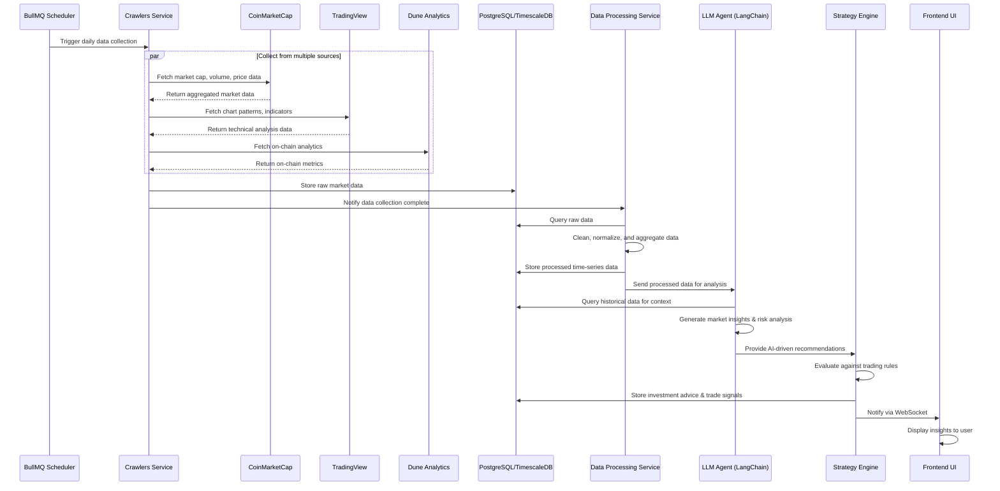
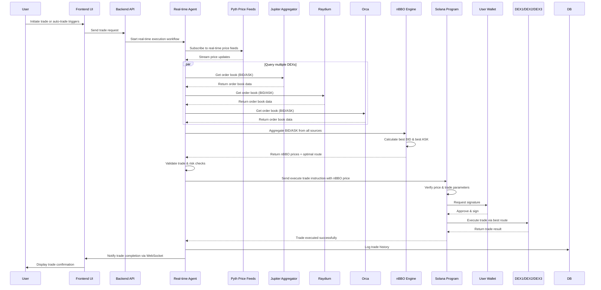

# Solana Frontier Web3 LLM Agent Architecture

## Overview
This project is a Web3 LLM agent platform for autonomous Solana trading, similar to b.ai. It combines AI-driven insights, real-time market data, and on-chain execution.

## Tech Stack

### Frontend (`/frontend`)
- **Framework**: React 18 + TypeScript
- **Styling**: Tailwind CSS
- **Wallet Integration**: Solana Wallet Adapter
- **State Management**: Zustand
- **Charts**: TradingView Lightweight Charts
- **API Client**: Axios

### Backend (`/backend`)
- **Runtime**: Node.js 20 + TypeScript
- **API Framework**: NestJS (modular, scalable)
- **LLM Integration**: LangChain (supports OpenAI, Anthropic, local models)
- **Workflow Orchestration**: Temporal (OpenClaw alternative - production-grade workflow engine)
- **Task Scheduling**: BullMQ + Redis
- **Database**: PostgreSQL + TimescaleDB (time-series optimization)
- **ORM**: Prisma
- **Real-time Communication**: WebSockets (Socket.IO)
- **Message Queue**: Redis
- **Data Validation**: Zod

### Smart Contracts (`/contracts`)
- **Framework**: Anchor (Solana)
- **DEX Integrations**: Jupiter, Raydium, Orca
- **Price Aggregation**: Pyth Network

### DevOps
- **Containerization**: Docker + Docker Compose
- **Monitoring**: Prometheus + Grafana
- **Logging**: Winston + ELK Stack (optional)

## High-Level Components

### 1. Frontend (`/frontend`)
- **Agent LLM UI**: Configure LLM vendors, API keys
- **Dashboard**: Monitor trading performance, market insights
- **Strategy Configuration**: Customize trading rules and parameters
- **Real-time Charts**: Display market data and trade history

### 2. Backend (`/backend`)
#### `/backend/api`
- REST API for frontend interactions
- Authentication and authorization
- Agent configuration management

#### `/backend/agents`
- LLM Agent orchestration (LangChain)
- Temporal workflow automation
- Daily strategy updates

#### `/backend/data`
- Market data ingestion layer
- Real-time data streaming from Dune, TradingView, CoinMarketCap, etc.
- Data processing and normalization

#### `/backend/crawlers`
- Web crawlers for collecting data from 3rd-party trade sites
- Scheduled scraping jobs (BullMQ)

#### `/backend/strategies`
- Trading strategy implementations
- nBBO (National Best Bid/Offer) price optimization
- Risk management logic

#### `/backend/db`
- Database models and connections (Prisma)
- Time-series data storage (TimescaleDB)
- Historical data querying

### 3. Smart Contracts (`/contracts`)
- Solana programs for on-chain execution
- Best price execution logic
- Secure trading interactions with DEXs via Jupiter

## Daily Offline Agents Workflow

This workflow runs periodically (daily/hourly) to gather market data, analyze it, and generate investment insights.

## Real-time Agents Workflow (nBBO Price Execution)

This workflow handles real-time trading with nBBO (National Best Bid/Offer) price optimization across multiple DEXs.

## Data Flow
1. Crawlers and real-time data links fetch market data from various sources
2. Data is ingested and stored in the database
3. LLM agents analyze the data and generate investment insights
4. Trading strategies execute trades using nBBO for best pricing
5. Results are displayed in the frontend UI

## Key Features

### Offline Analysis
- Scheduled data collection from CoinMarketCap, TradingView, Dune
- Historical data aggregation and normalization
- LLM-powered market analysis and insight generation
- Strategy backtesting

### Real-time Trading
- Multi-DEX order book aggregation
- nBBO price calculation and route optimization
- Low-latency trade execution via Solana programs
- Real-time price feeds from Pyth Network
