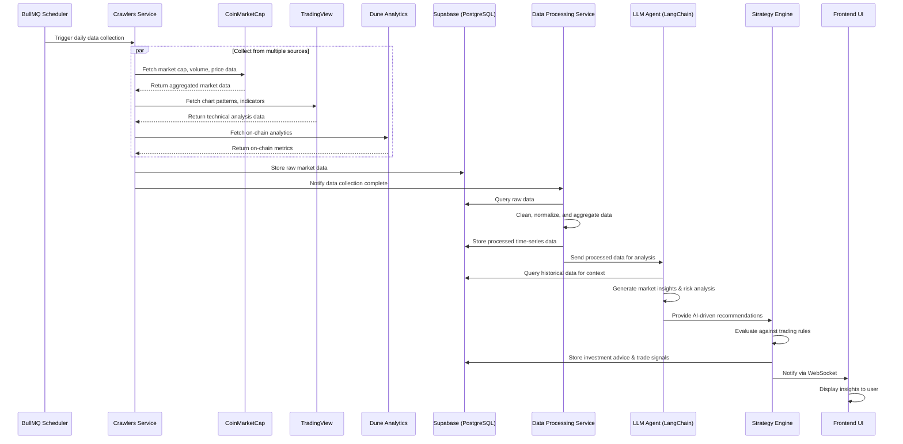
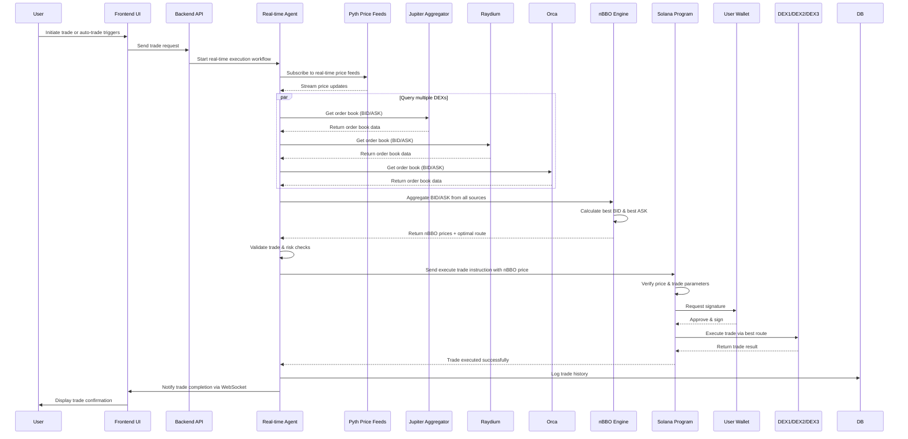
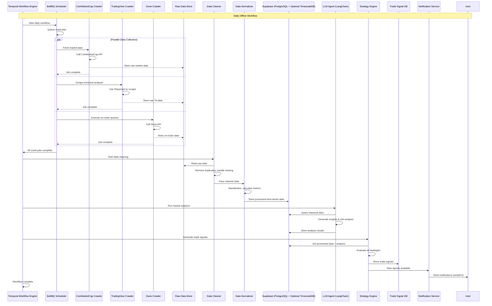
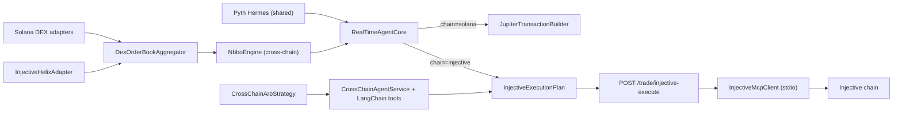
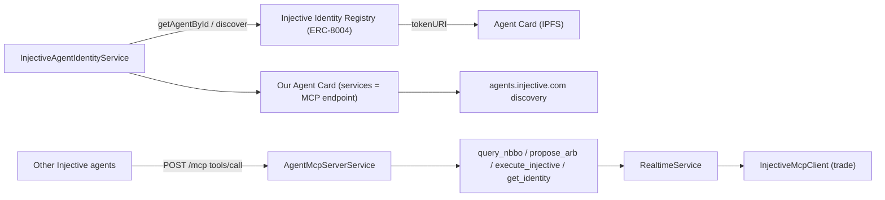

# Solana Frontier Web3 LLM Agent Architecture

## Overview
This project is a Web3 LLM agent platform for autonomous Solana trading, similar to b.ai. It combines AI-driven insights, real-time market data, and on-chain execution.

## Tech Stack

### Frontend (`/frontend`)
- **Framework**: React 18 + TypeScript
- **Styling**: Tailwind CSS
- **Wallet Integration**: Solana Wallet Adapter
- **State Management**: Zustand
- **Charts**: TradingView Lightweight Charts
- **API Client**: Axios

### Backend (`/backend`)
- **Runtime**: Node.js 20 + TypeScript
- **API Framework**: NestJS (modular, scalable)
- **LLM Integration**: LangChain (supports OpenAI, Anthropic, local models)
- **Workflow Orchestration**: Temporal (OpenClaw alternative - production-grade workflow engine)
- **Task Scheduling**: BullMQ + Redis
- **Database**: Supabase (PostgreSQL) with optional TimescaleDB extension
- **ORM**: Prisma
- **Real-time Communication**: WebSockets (Socket.IO)
- **Message Queue**: Redis
- **Data Validation**: Zod

### Smart Contracts (`/contracts`)
- **Framework**: Anchor (Solana)
- **DEX Integrations**: Jupiter, Raydium, Orca
- **Price Aggregation**: Pyth Network

### DevOps
- **Containerization**: Docker + Docker Compose
- **Monitoring**: Prometheus + Grafana
- **Logging**: Winston + ELK Stack (optional)

## High-Level Components

### 1. Frontend (`/frontend`)
- **Agent LLM UI**: Configure LLM vendors, API keys
- **Dashboard**: Monitor trading performance, market insights
- **Strategy Configuration**: Customize trading rules and parameters
- **Real-time Charts**: Display market data and trade history

### 2. Backend (`/backend`)
#### `/backend/api`
- REST API for frontend interactions
- Authentication and authorization
- Agent configuration management

#### `/backend/agents`
- LLM Agent orchestration (LangChain)
- Temporal workflow automation
- Daily strategy updates

#### `/backend/data`
- Market data ingestion layer
- Real-time data streaming from Dune, TradingView, CoinMarketCap, etc.
- Data processing and normalization

#### `/backend/crawlers`
- Web crawlers for collecting data from 3rd-party trade sites
- Scheduled scraping jobs (BullMQ)

#### `/backend/strategies`
- Trading strategy implementations
- nBBO (National Best Bid/Offer) price optimization
- Risk management logic

#### `/backend/db`
- Database models and connections (Prisma)
- Time-series data storage (TimescaleDB)
- Historical data querying

### 3. Smart Contracts (`/contracts`)
- Solana programs for on-chain execution
- Best price execution logic
- Secure trading interactions with DEXs via Jupiter

## Daily Offline Agents Workflow

This workflow runs periodically (daily/hourly) to gather market data, analyze it, and generate investment insights.



## Real-time Agents Workflow (nBBO Price Execution)

This workflow handles real-time trading with nBBO (National Best Bid/Offer) price optimization across multiple DEXs.



## Data Flow
1. Crawlers and real-time data links fetch market data from various sources
2. Data is ingested and stored in the database
3. LLM agents analyze the data and generate investment insights
4. Trading strategies execute trades using nBBO for best pricing
5. Results are displayed in the frontend UI

## Key Features

### Offline Analysis
- Scheduled data collection from CoinMarketCap, TradingView, Dune
- Historical data aggregation and normalization
- LLM-powered market analysis and insight generation
- Strategy backtesting

### Real-time Trading
- Multi-DEX order book aggregation
- nBBO price calculation and route optimization
- Low-latency trade execution via Solana programs
- Real-time price feeds from Pyth Network

---

## Offline Agent System Design

### Overview
The Offline Agent System is responsible for periodic data collection, analysis, and strategy updates. It runs on a schedule (hourly/daily) and generates investment insights for users.

### Core Components

#### 1. Scheduler (`backend/crawlers/scheduler.ts`)
- **Responsibility**: Manage periodic job execution
- **Tech**: BullMQ + Redis
- **Features**:
  - Configurable cron schedules for different data sources
  - Job queuing and retries with exponential backoff
  - Job status tracking and monitoring
  - Dependency management (wait for all data sources before analysis)

#### 2. Data Crawlers (`backend/crawlers/`)
Each crawler is a dedicated module for a specific data source:

##### CoinMarketCap Crawler (`backend/crawlers/coinmarketcap.ts`)
- Fetch top 100 tokens by market cap
- Get 24h price change, volume, market cap
- Fetch social sentiment data
- API: CoinMarketCap API v2

##### TradingView Crawler (`backend/crawlers/tradingview.ts`)
- Scrape technical indicators (RSI, MACD, Bollinger Bands)
- Fetch chart patterns (support/resistance levels)
- Get fear & greed index
- Implementation: Playwright (headless browser) or TradingView API

##### Dune Analytics Crawler (`backend/crawlers/dune.ts`)
- Execute pre-defined Dune queries
- Fetch on-chain metrics:
  - Daily active addresses
  - Transaction volume
  - TVL (Total Value Locked)
  - Gas fees
  - Staking data
- API: Dune API v2

##### Additional Data Sources
- DefiLlama: For protocol TVL and DeFi data
- Glassnode: For on-chain analytics
- Twitter/X: For social sentiment (optional)

#### 3. Data Processing Pipeline (`backend/data/`)
##### Raw Data Storage (`backend/data/raw.ts`)
- Store unprocessed data from crawlers
- JSON format with metadata (source, timestamp)
- Time-series partitioning by day

##### Data Cleaning (`backend/data/cleaner.ts`)
- Remove duplicate entries
- Handle missing values (interpolation/forward fill)
- Validate data ranges
- Normalize units and formats

##### Data Normalization (`backend/data/normalizer.ts`)
- Standardize data schemas across sources
- Calculate derived metrics:
  - Price momentum (1h, 24h, 7d)
  - Volume trends
  - Volatility (standard deviation)
  - Relative strength

##### Feature Engineering (`backend/data/features.ts`)
- Calculate technical indicators
- Create lag features (past N periods)
- Generate sentiment scores
- Create market regime labels (bullish/bearish/sideways)

#### 4. Database Models (`backend/db/schema.prisma`)
```prisma
model MarketData {
  id        String   @id @default(cuid())
  token     String
  timestamp DateTime
  source    String   // coinmarketcap, tradingview, dune
  price     Float?
  volume24h Float?
  marketCap Float?
  // Technical indicators
  rsi       Float?
  macd      Float?
  // On-chain metrics
  tvl       Float?
  activeAddresses Int?
  // Custom fields
  rawData   Json
  createdAt DateTime @default(now())

  @@index([token, timestamp])
  @@index([source, timestamp])
}

model AnalysisResult {
  id        String   @id @default(cuid())
  token     String
  timestamp DateTime
  type      String   // market_insight, risk_analysis, recommendation
  content   String   // LLM-generated analysis
  score     Float?   // 0-1 confidence score
  metadata  Json?
  createdAt DateTime @default(now())
}

model TradeSignal {
  id        String   @id @default(cuid())
  token     String
  timestamp DateTime
  action    String   // buy, sell, hold
  reason    String
  price     Float
  strategy  String
  status    String   // pending, executed, cancelled
  createdAt DateTime @default(now())
}
```

#### 5. LLM Agent (`backend/agents/llm-agent.ts`)
Built with LangChain, featuring:
- Configurable LLM providers (OpenAI, Anthropic, local Llama)
- Prompt templates for different analysis types
- Memory for context retention across runs
- Tools:
  - Historical data query tool
  - Technical analysis calculator
  - Risk assessment tool

##### Analysis Types
1. **Market Overview**: Daily summary of top movers, volume trends
2. **Token Deep Dive**: Detailed analysis of specific tokens
3. **Risk Assessment**: Portfolio risk analysis and recommendations
4. **Strategy Update**: Refine trading strategies based on new data

#### 6. Strategy Engine (`backend/strategies/`)
##### Strategy Interface
```typescript
interface Strategy {
  name: string;
  description: string;
  parameters: StrategyParameter[];
  analyze(data: MarketData[]): Promise<TradeSignal[]>;
  backtest(data: MarketData[], params: Record<string, any>): Promise<BacktestResult>;
}
```

##### Built-in Strategies
- **Trend Following**: Moving average crossover
- **Mean Reversion**: RSI-based oversold/overbought
- **Breakout**: Support/resistance level breaks
- **Custom**: User-defined strategies via UI

#### 7. Temporal Workflows (`backend/agents/workflows/`)
Define the end-to-end offline agent workflow:

```typescript
// Daily Analysis Workflow
async function dailyAnalysisWorkflow(): Promise<void> {
  // 1. Trigger all crawlers in parallel
  await Promise.all([
    crawlCoinMarketCap(),
    crawlTradingView(),
    crawlDune(),
  ]);

  // 2. Process and normalize data
  await processAndNormalizeData();

  // 3. Run LLM analysis
  await runLLMAnalysis();

  // 4. Generate trade signals
  await generateTradeSignals();

  // 5. Notify users
  await notifyUsers();
}
```

---

## Offline Agent Detailed Sequence Diagram



---

## Configuration System

### LLM Configuration (`backend/config/llm.config.ts`)
```typescript
interface LLMConfig {
  provider: 'openai' | 'anthropic' | 'local';
  apiKey?: string;
  model: string;
  temperature: number;
  maxTokens: number;
}
```

### Crawler Configuration (`backend/config/crawlers.config.ts`)
```typescript
interface CrawlerConfig {
  coinmarketcap: {
    apiKey: string;
    updateInterval: string; // cron
  };
  tradingview: {
    updateInterval: string;
  };
  dune: {
    apiKey: string;
    queries: string[];
  };
}
```

### Strategy Configuration (`backend/config/strategies.config.ts`)
```typescript
interface StrategyConfig {
  enabled: string[];
  riskManagement: {
    maxPositionSize: number;
    stopLoss: number;
    takeProfit: number;
  };
}
```

---

## Monitoring & Observability

- **Prometheus Metrics**:
  - Crawler success/failure rates
  - Data processing latency
  - LLM token usage
  - Strategy performance
- **Grafana Dashboards**: Visualize all metrics
- **Logging**: Winston with structured JSON logs
- **Alerting**: Alertmanager for job failures and anomalies

---

## Injective Cross-Chain Layer (Nova Program)

The realtime agent is extended to operate across **Solana and Injective** without changing its core orchestration. Chain-specific behaviour is injected behind existing interfaces.

### Chain abstraction

- `DexQuote` now carries `chain: "solana" | "injective"`.
- `TokenInfo` carries both an optional Solana `mint` and an optional Injective `denom`.
- `TokenPair` carries an optional `chain` flag (used for Injective perpetuals that have no base denom).
- `RealTimeAgentCore.prepareTrade` dispatches by the selected route's `chain`:
  - `solana` → `JupiterTransactionBuilder` (unsigned swap tx)
  - `injective` → builds an `InjectiveExecutionPlan` (executed later via an explicit endpoint)

### Injective adapters

- **`InjectiveHelixAdapter`** (`backend/src/dex/injective-helix-adapter.ts`) — implements `DexAdapter` against the public Injective exchange REST API (`/api/exchange/v2/{spot,derivative}/orderbook`). Returns quotes tagged `chain: "injective"` and embeds the Helix `marketId` in `quote.raw` so the executor knows which market to trade.
- **`InjectivePythPriceFeedService`** (`backend/src/oracle/injective-pyth-adapter.ts`) — Injective shares the Pyth Hermes oracle network with Solana, so this is a thin chain-scoped wrapper over the existing `PythPriceFeedService`. INJ/USDC/USDT use real Pyth feed IDs.

Both adapters are registered in `RealtimeService.onModuleInit` only when `ENABLE_INJECTIVE=true`, and `injective_helix` is added to the risk policy's `allowedDexes`.

### Execution via the official Injective MCP server

Instead of re-implementing Cosmos signing, the project spawns the open-source [Injective MCP server](https://github.com/InjectiveLabs/mcp-server) as a stdio child process and speaks JSON-RPC 2.0 to it (`backend/src/transactions/injective-mcp-client.ts`).

- `InjectiveMcpClient` performs the MCP `initialize` handshake, then calls the `trade_open` tool with `{ market_id, market_type, side, amount, price }` derived from the `InjectiveExecutionPlan`.
- The MCP server fetches the oracle price, quantizes size/margin, builds, signs (using `INJECTIVE_MNEMONIC`), and broadcasts — returning a tx hash.
- When no mnemonic is configured, `MockInjectiveTradeExecutor` returns a simulated tx hash so the full lifecycle is exercisable in demos.
- Execution is **explicit** (`POST /realtime/trade/injective-execute`); `prepareTrade` never signs, mirroring how the Solana side returns an unsigned transaction.

### Cross-chain arbitrage & NL assistant

- **`CrossChainArbStrategy`** (`backend/src/strategy/strategies/cross-chain-arb.strategy.ts`) scans assets that trade on both chains (BTC, ETH) and emits a signal when the Solana↔Injective spread exceeds the estimated deBridge/Peggy bridge cost. Signals include the recommended buy-chain, sell-chain, and bridge path.
- **`CrossChainAgentService`** (`backend/src/realtime/cross-chain-agent.service.ts`) exposes two LangChain tools (`query_cross_chain_nbbo`, `propose_arb_plan`) to a ChatOpenAI model so a user can ask for a cross-chain plan in natural language — aligning with Injective's "natural language trading via MCP" narrative. Falls back to a deterministic summary when no LLM key is set.

### Data flow (Injective-enabled)



## Injective Agent Identity Layer (ERC-8004)

The Nova Program's flagship "agent infrastructure" story is on-chain agent identity. The project now participates bidirectionally:

- **Consumes** the official Injective MCP server to execute trades (above).
- **Is** an on-chain Injective agent (ERC-8004 identity) and **exposes** its own MCP server.

### Components

- `InjectiveAgentIdentityService` (`backend/src/agent/injective-agent-identity.service.ts`) — returns our agent's identity card. Real when `INJECTIVE_AGENT_ID` is set (fetched on-chain), otherwise a deterministic simulated card. Also lists the registry.
- `InjectiveRegistryReader` (`backend/src/agent/injective-registry.viem.ts`) — read-only `viem` client for the canonical Injective Identity Registry (testnet `0x8004A818…`, mainnet `0x8004A169…`). Supports `getAgentById` (ownerOf / tokenURI / getAgentWallet / getMetadata) and a bounded `discoverAgentIds` Transfer-event scan. No `@injective/agent-sdk` dependency (it is not yet published to npm); addresses/ABI are sourced from the official SDK repo.
- `AgentMcpServerService` (`backend/src/realtime/agent-mcp-server.service.ts`) — a standards-compliant MCP server (Streamable HTTP at `POST /mcp`) built with `@modelcontextprotocol/sdk`, dynamically imported (ESM) from the CommonJS NestJS build. Tools: `query_cross_chain_nbbo`, `propose_arb_plan`, `execute_injective_trade`, `get_agent_identity`.

### Identity + MCP data flow


