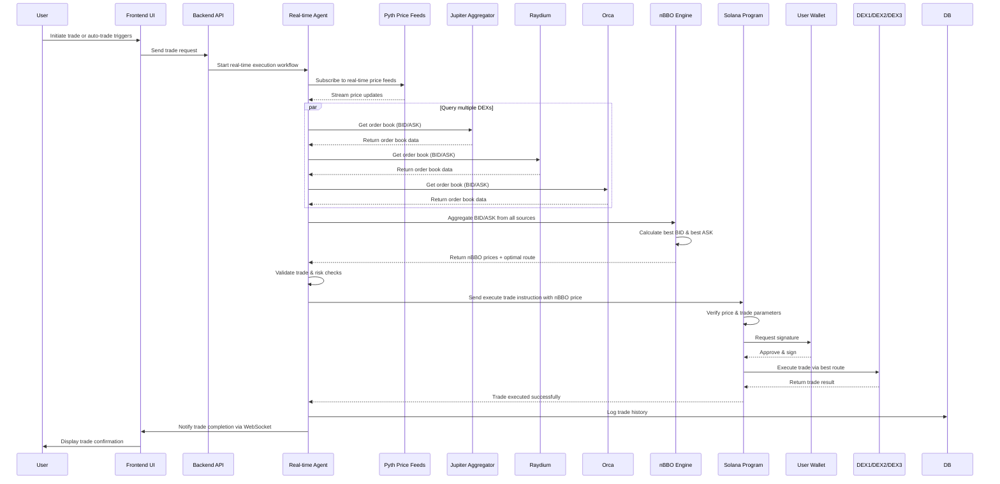

# Realtime Agent System Design

## Overview
The Realtime Agent System is responsible for handling real-time trading with nBBO (National Best Bid/Offer) price optimization across multiple Solana DEXs.

## Core Components

### 1. Backend API & WebSocket Setup
- Add new API endpoints for trade initiation
- Add WebSocket server for real-time trade status notifications
- Integrate with existing NestJS module structure

### 2. Pyth Price Feeds Integration
- Connect to Pyth Network real-time price feeds
- Add subscription logic for multiple token pairs
- Parse and validate incoming price updates

### 3. DEX Order Book Aggregation
- Integrate with Jupiter Aggregator SDK
- Add Raydium SDK integration for order book
- Add Orca SDK integration for order book
- Implement parallel DEX querying for best performance

### 4. nBBO Engine Implementation
- Logic to aggregate BID/ASK prices from all DEX sources
- Calculate National Best Bid (highest bid) and Best Ask (lowest ask)
- Select optimal route based on best price and liquidity
- Integrate with backend services

### 5. Real-time Agent Core
- Orchestration service to manage workflow
- Trade validation and risk checks (position size, stop loss, etc.)
- Error handling and retry logic

### 6. Smart Contracts (Anchor)
- Create Solana program for trade execution
- Implement price verification
- Add secure multi-sign wallet integration
- Add Jupiter/Raydium/Orca integration from program
- Log all trade history to on-chain state

### 7. Frontend Integration
- Add trade initiation UI
- Connect to backend WebSocket
- Display real-time trade status and confirmation
- Connect to Solana Wallet Adapter for signing

### 8. Database & Logging
- Extend Prisma schema for trade history (if needed)
- Add logging for all real-time agent actions
- Add Prometheus metrics for latency, DEX performance, etc.

## Real-time Agents Workflow (nBBO Price Execution)
This workflow handles real-time trading with nBBO (National Best Bid/Offer) price optimization across multiple DEXs.

